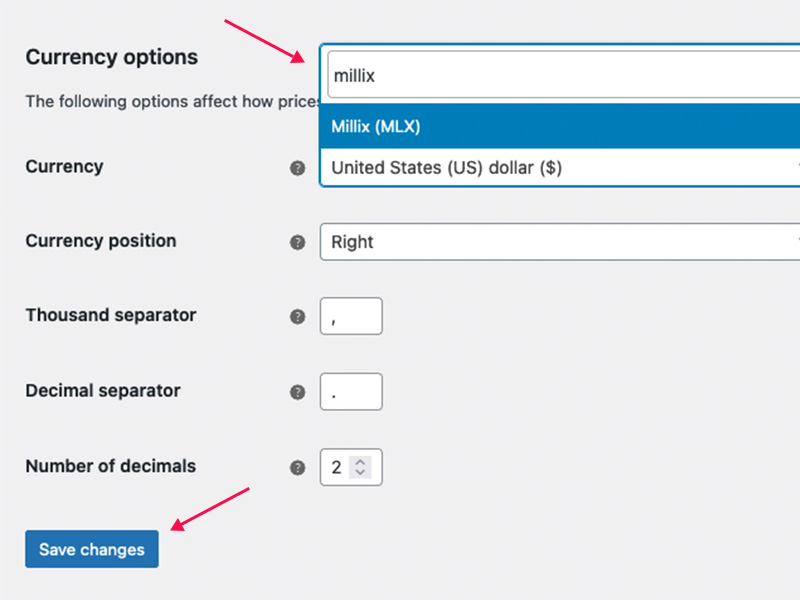
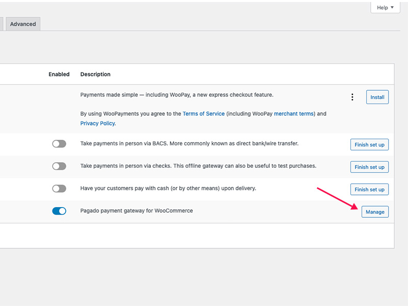
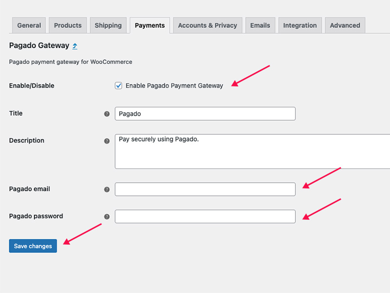
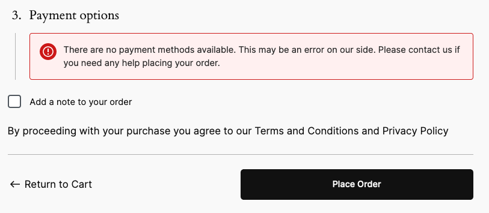
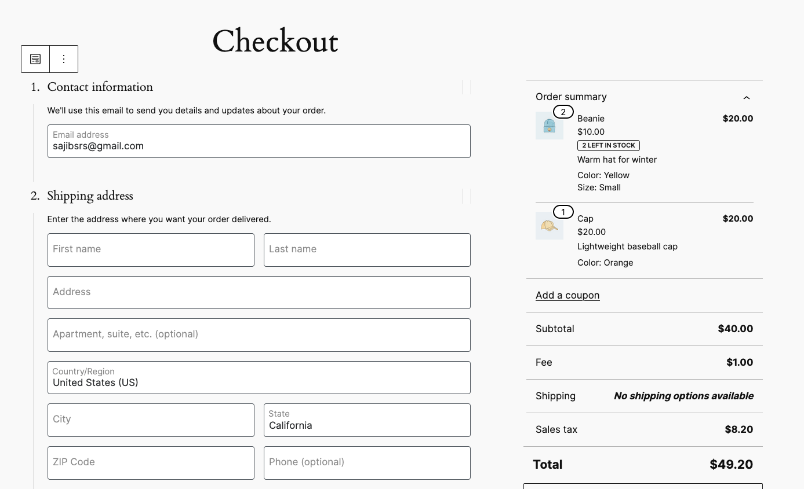
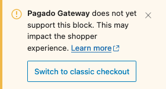

# Pagado WooCommerce Payment Method
Please check PHP and WordPress versions compatibility [here](https://make.wordpress.org/core/handbook/references/php-compatibility-and-wordpress-versions/) before you proceed.

## # Tested environment
* PHP 8.2.11
* WordPress 6.4.2
* WooCommerce 8.4.0
* Pagado 1.2.4

## # Installation
1. Have WordPress installed and running.
2. Install and activate WooCommerce.
3. Install and activate Pagado Payment Processor plugin.

## # WooCommerce settings
1. Go to WooCommerce -> Settings -> General tab
2. From Currency options -> Currency, select **Millix (MLX)**.
3. Use **Save changes** button to save the configuration.

4. From WooCommerce -> Settings -> Payment tab, you should see **Pagado Gateway** is activated by default. If not make sure it's activated.
5. Click on **Manage** button.

1. Check **Enable Pagado Payment Gateway**.
2. Insert your pagado email and password into the respective fields.
3. Use **Save changes** button to save the configuration.

## # Trouble shooting
### # Pagado payment option is not available

Starting with WooCommerce version 8.3, WooCommerce Cart and Checkout Blocks are the default for new installation. *Unfortunately, Pagado Payment Gateway* doesn't support block yet as it's in its very early stage of development. That's why it's not available in Block editor mode.

To get **Pagado Payment method** working, you have to switch to **Classic Editor** mode. To do that

1. Login to your WordPress site as admin.
2. Edit your checkout page by going to pages -> checkout or simply vising checkout page and click on the **Edit** from the top right on the screen.
3. When in the edit checkout page click any content from the left side.

4. You'll see a **Pagado Gateway** warning.
5. Click on the **Switch to classic checkout** button.

6. You should see a warning. Click on **Switch**.
7. Finally **Update** the page.

*Note: You can simply switch to classic editor as well.*

Now you should be able to see **Pagado** as a payment option.
