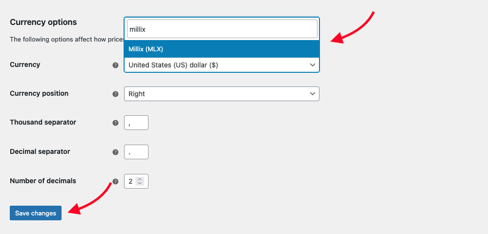
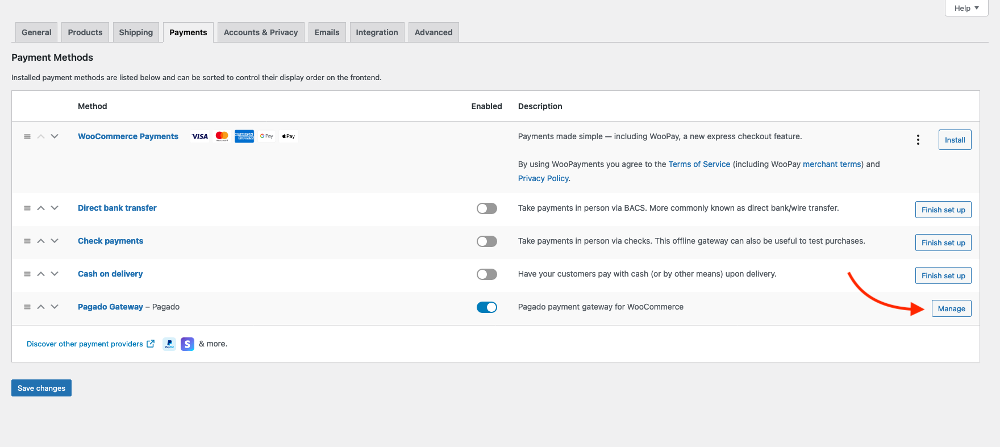
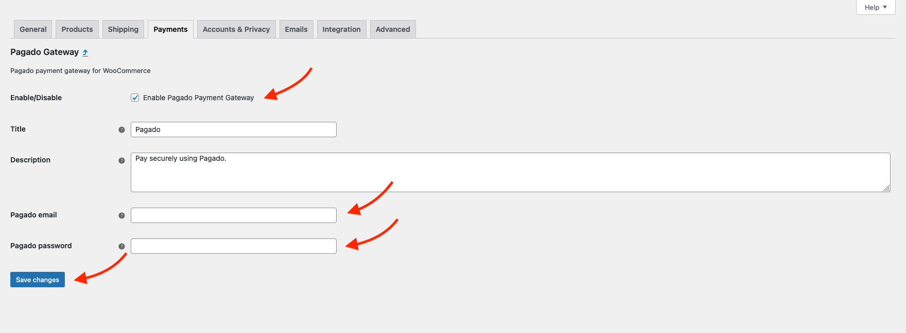
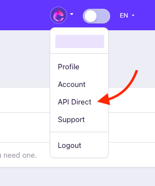
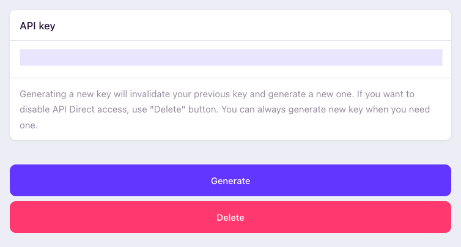
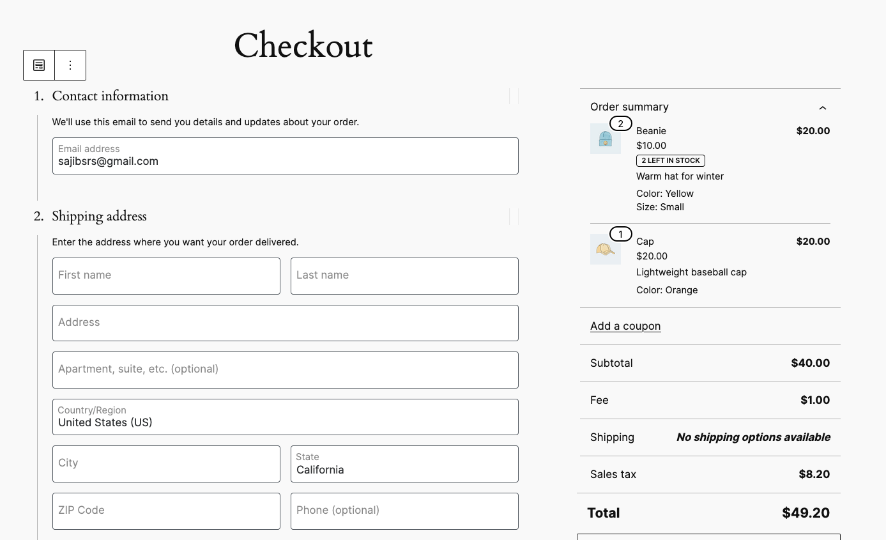
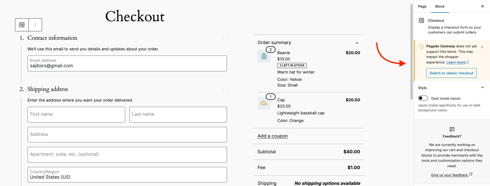
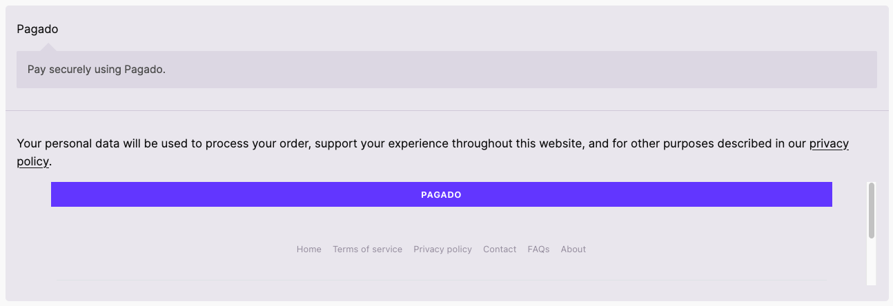

# Pagado WooCommerce Payment Method
Please check PHP and WordPress versions compatibility [here](https://make.wordpress.org/core/handbook/references/php-compatibility-and-wordpress-versions/) before you proceed.

## # Tested environment
* PHP 8.2.11
* WordPress 6.4.2
* WooCommerce 8.4.0
* Pagado 1.2.4

## # Installation
1. Have WordPress installed and running.
2. Install and activate WooCommerce.
3. Install and activate Pagado Payment Processor plugin.

## # WooCommerce settings
1. Go to WooCommerce -> Settings -> General tab
2. From Currency options -> Currency, select **Millix (MLX)**.
3. Use **Save changes** button to save the configuration.

1. From WooCommerce -> Settings -> Payment tab, you should see **Pagado Gateway** is activated by default. If not make sure it's activated.
2. Click on **Manage** button.

1. Check **Enable Pagado Payment Gateway**.
2. Insert your pagado email and password into the respective fields.
3. Use **Save changes** button to save the configuration.

## # Dokan multi-vendor settings
Starting from Pagado version 2.0.0, Dokan multi-vendor support has been added. It allows seamless integration with Pagado payment gateway. While is has full support for Dokan, it also supports some additional features like instant automatic payment to vendor.

*Note: Dokan features and documentation can be found [here](https://dokan.co/docs/wordpress).*

### # Get your Pagado API Direct key
Pagado API Direct allows it's user to use **supported** features through it's API with API Direct key (logging into account is not necessary).

1. Login to pagado.
2. Select API Direct from menu.

   

3. Generate new key if you haven't already. You can `Generate` new one if you already have one. Use `Delete` if you want to disable API Direct access to your account.

    

4. You should get that key from here for use. You can always come back and get your existing key from here.

### # Admin setup
1. Login into WordPress as Admin.
2. From dashboard menu (on the left) go to `WooCommerce -> Settings`.
3. Select `Payments` tab.
4. Click on `Pagado Gateway -> Manage` button.

### # Vendor setup

## # Trouble shooting
### # Pagado payment option is not available

Starting with WooCommerce version 8.3, WooCommerce Cart and Checkout Blocks are the default for new installation. *Unfortunately, Pagado Payment Gateway* doesn't support block yet as it's in its very early stage of development. That's why it's not available in Block editor mode.

To get **Pagado Payment method** working, you have to switch to **Classic Editor** mode. To do that

1. Login to your WordPress site as admin.
2. Edit your checkout page by going to pages -> checkout or simply vising checkout page and click on the **Edit** from the top right on the screen.
3. When in the edit checkout page click any content from the left side.

1. You'll see a **Pagado Gateway** warning.
2. Click on the **Switch to classic checkout** button.

1. You should see a warning. Click on **Switch**.
2. Finally **Update** the page.

*Note: You can simply switch to classic editor as well.*

Now you should be able to see **Pagado** as a payment option on the checkout page.

